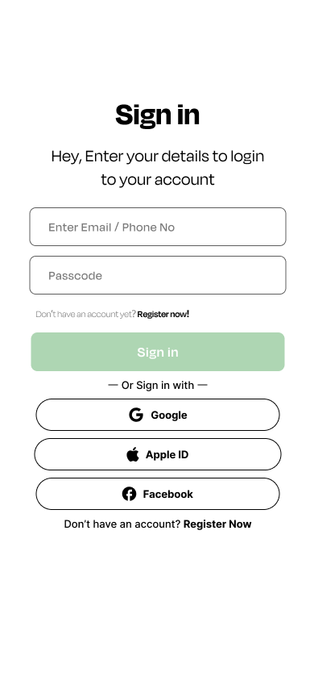
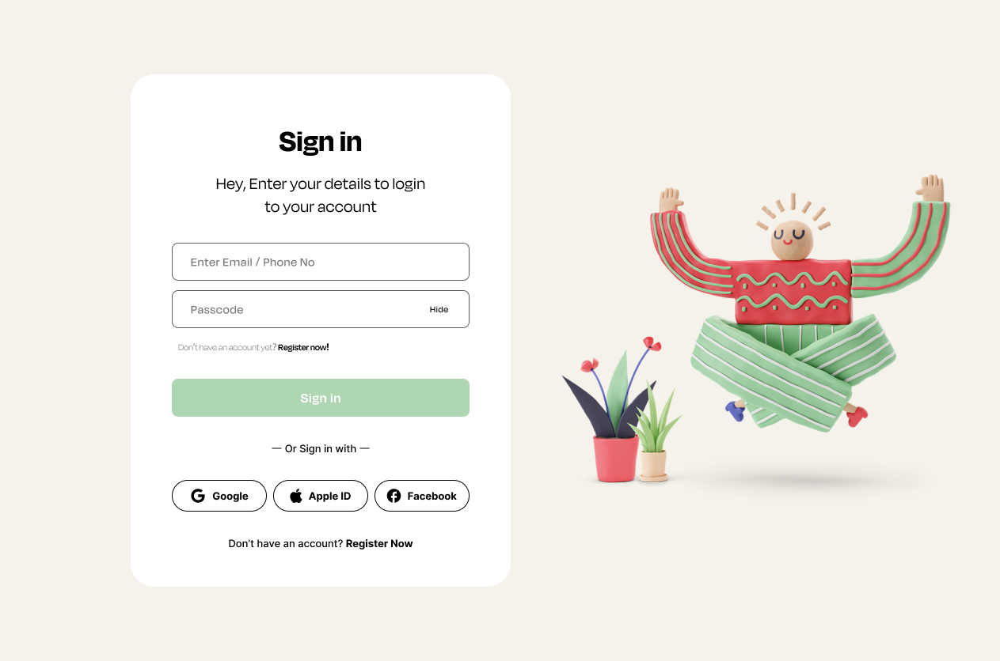

# **🔒 Diseño de Login Responsivo**
 

 

 

## **Diseño de Figma**
 Puedes encontrar el diseño completo de este proyecto en [Figma](https://www.figma.com/file/OFHq4cINFwcDy2VoTn1k70/Log-in-page-(Community)?type=design&node-id=106%3A2&mode=design&t=qUqEsrTv77gxOtFw-1).

